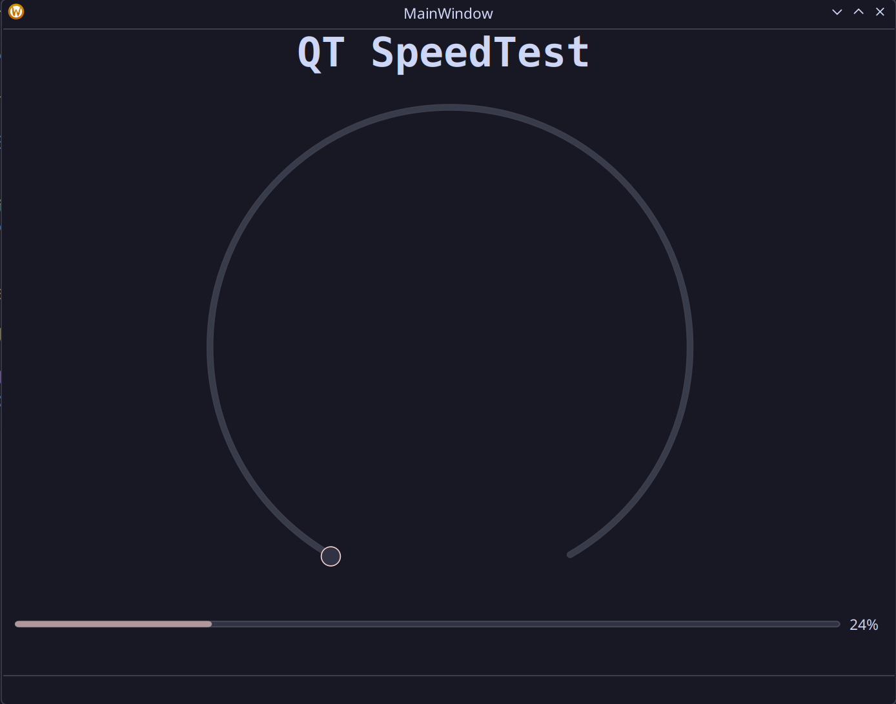
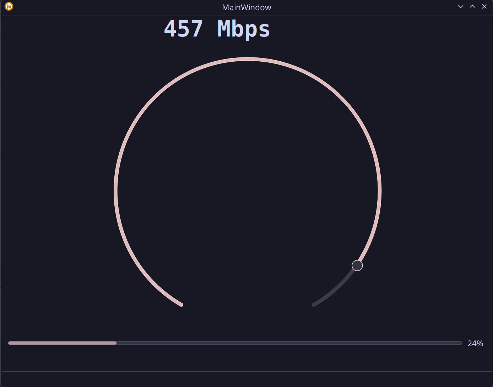

# QT Bandwidth monitor

  

*test project to explore QT (pronounced cute) and C++*

## Initial impressions

Seems to be some similarities to how UI is controlled when working with Unity projects, 
especially Unitys new UI framework (UI Toolkit) which leverage markup language similar to XML for their UI.

Having a good experience with QT so far with my slow but steady progress and exploration, connecting the value of a dial to a label.

	
	

## Future plans

This project aims to be a simple network bandwith speed tester. 
I chose a speed tester because values needs to be updated in (near) real-time, displaying the updates to the UI. 
I also need to figure out how to calculate this in C++. 

